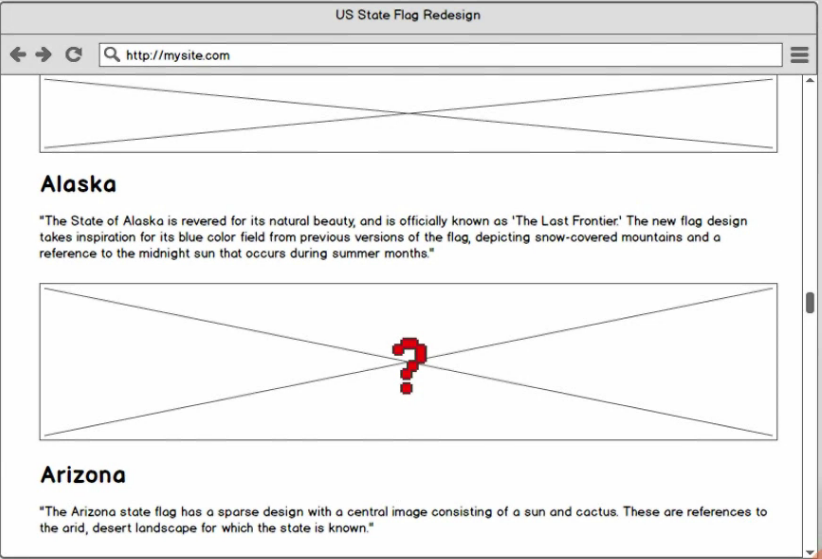
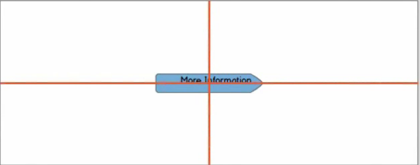

# ux-notes

### Shapes

---

- The user loves easy to see easy shapes
- Central vision requires more effort than the peripheral vision
- If the user has to visually scan the UI to understand it, the cognitive friction will be **high** but if the user's brain can break the UI down into big shapes, it will be **low**

### White space

---

- A crowded UI requires your user's brain to use central vision wich makes cognitive friction **HIGH**
- Using whitespace allows your user's brain to user peripheral vision wich helps make cognitive friction **LOW**
- It allows the brain to rest while processing your UI
- It helps user focus on important information

The user doesn't have space to rest his vision

The user can focus on the form because the form is highlighted by the whitespace

### Grouping

---

- The user's brain loves groups
- Grouping, Whitespaces and Shapes work together
- Crowded groups that are too close together requires the ures's brain to use central vision wich makes cognitive friction **HIGH**
- Repeating groups without enough visual separation make cognitive friction **HIGH**
- Whitespace withing and between groups allows your user's brain to use peripheral vision wich helps make cognitive friction **LOW**

#### Bad

The user doesn't know which description belongs to which image until they read the description and based on their knowledge they do the association.

#### Good

Adding whitespace between groups we made easier to the user to identify which image belongs to which group

### Alignment

---

- Bad alignment is one of the silent UX killer
- Misalignment can make cognitive friction **HIGH**
- The brain can detect small misalignments
- There are many alignment options but you should be consistent
- Align with reading direction language
- Whitespace and grouping create alignmaent scopes
- Regularly, text inside of a button should be aligned centered vertically and horizontally

#### Bad

Text inside of a button should be in the center

#### Good

Text is in the center of the button

#### Bad

The alignment it is not consistent

#### Good

The items should be aligned with the reading direction of your users and be consistent

### Attention

---

- Movement in pripheral vision is powerful so it should be used wisely

- If user focus is needed:
  - Movement in peripheral vision will **DISTRACT**
  - Keep the UI **CALM**

Example:
The UI shold be calm to not distract the user

- If user attention is needed:
  - No movement in peripheral vision will not **ATTRACT**
  - User movement to get the user's **ATTENTION**

Example:
When a change happen, is a good option to highlight with an animation the changes in the interface so that the user can notice it

- Turn off animated ads and live data streams to keep user focus
